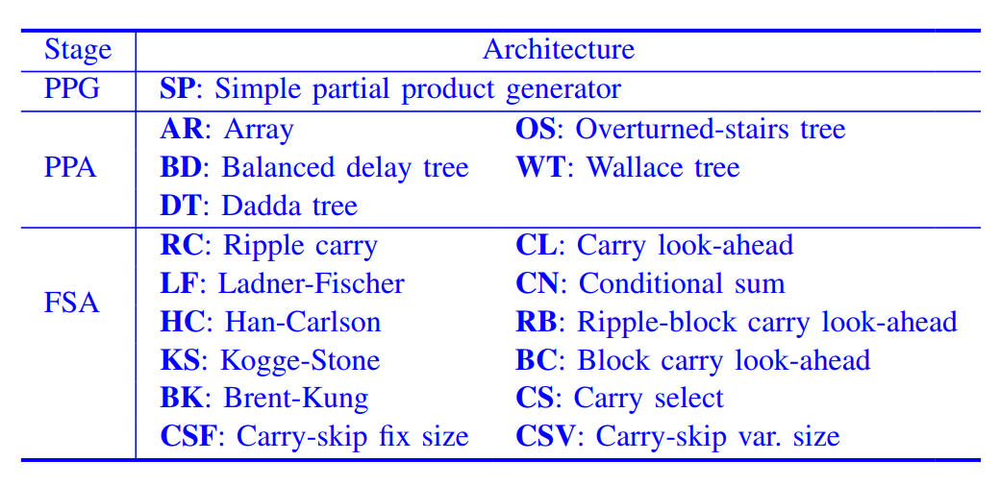

# RefSCAT
Formal Verification of Logic-Optimized Multipliers via Automated Reference Multiplier Generation and SCA-SAT Synergy

RefSCAT: Paper's Benchmark

## Benchmark Description

### Multiplier Generator
1. ``AMG`` (AMG): Y. Watanabe, N. Homma, T. Aoki, and T. Higuchi, “Formal design of decimal arithmetic circuits using arithmetic description language,” in 2006 International Symposium on Intelligent Signal Processing and Communications, 2006, pp. 419–422
2. ``GenMul`` (GML): A. Mahzoon, D. Große, and R. Drechsler, GenMul: Generating Architecturally Complex Multipliers to Challenge Formal Verification Tools. Cham: Springer International Publishing, 2021, pp. 177–191.
3.  ``MultGen`` (MGL): “Integer multiplier generator for verilog,” https://github.com/temelmertcan/multgen ,2023.

### Multiplier Architecture

